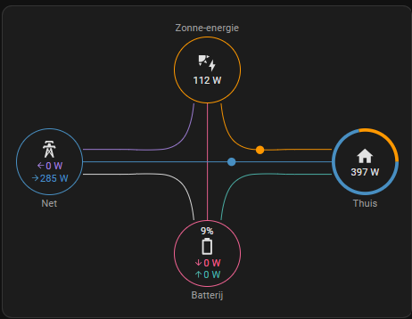

# home-assistant-modbus-ecactus-ecos

This configuration is based on [github repo for the blauhoff battery](https://github.com/driesk81/home-assistant-modbus-home-battery-blauhoff) adding registers for eCactus ECOS from [this post](https://community.home-assistant.io/t/interface-home-battery-blauhoff-or-ecactus-via-esphome-and-modbus/645345). Also i use an ESP32-S3 allowing it to fit into a small box.


## Let home assistant control your all in one home battery via modbus and esphome.

This yaml can be used to control ecactus-ecos systems.
The main purpose is to make the BMS (battery management system) available in Home Assistant to make automated charge/discharge possible. 
**Use at your own risk.**

## Installing ESPHome Manually
* ```python --version``` Should give the Python vesion 3.xx.x If no version is returned please install python
* ```pip3 install wheel```
* ```pip3 install esphome```
* ```esphome version``` should return Version: 202x.x.x.
* Edit the `secrets.yaml` by copying `secrets_example.yaml` and change it by reflecting your local settings
* ```esphome run ecactus.yaml``` on the first time you have to connect usb to pc. All other version can go over the air as long you are connected to same network 
 
# some remarks: 
* Make sure that your wifi credentials in the `secrets.yaml`.
* The yaml is tested on a esp32-s3 connected to a TTL to RS485 converter. You can use another esp32 but will need to change the yaml
* BMS settings can be selected in home assistant via list options and are pushed when [change modus] button is pressed.
* Known issue:  Component modbus_controller took a long time for an operation (0.05 s) and Components should block for at most 20-30ms i seen no effect or solution.

# hardware used:
   * ecactus-ecos
   * ESP32-S3
   * TTL to RS485 converter
   * container
   * some wire

# setup home assistant with: 
  * HACS
  * ESPHome
  * Power Flow Card

# setup 
  * Flash ESPHome to ESP32
  * Edit yaml on ESP32
 
 # Hardware setup
 
 

# lovelace setup

```
 type: custom:power-flow-card
watt_threshold: 1000
entities:
  battery: sensor.yoursensorname_dsp_power
  battery_charge: sensor.yoursensorname_esp_v2_soc
  grid: sensor.yoursensorname_grid_power
  solar: sensor.yoursnesorname_pv_power
```
 


# Research links

* (Use of resistor)[https://know.innon.com/bias-termination-rs485-network]

# Issues

* When there are more inverters (master=0x01 /slave=0x02) there is communication over the RS485 port between
master and slave which throws of the values recieved
* On regular basis a command is send to request all state of charge (36155) to all available addresses (0-10)

# TODO

* Add code to modbus controller to work with listner, only sending requests in ready state
* Implement queue
* Implemenent counter for the number of registers
* Prevent sending for now in sniffer mode
* In modbus controller add the bus-address used to sniff
* Modbus should keep sniffer state by bus-address 
* Change the code, the controller should be the sniffer
* Mobus should just reproces, if it hangs to long
* In modbus send only then in queue is empty